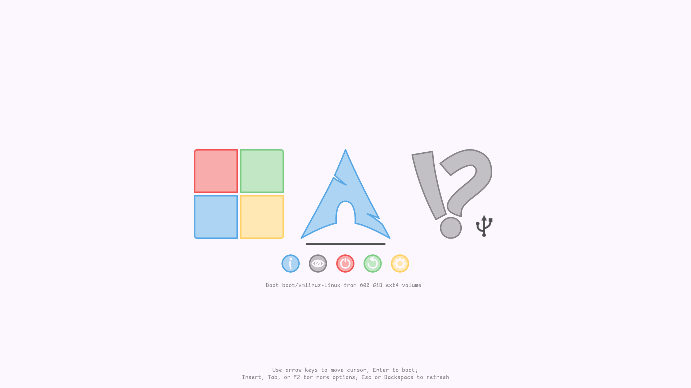
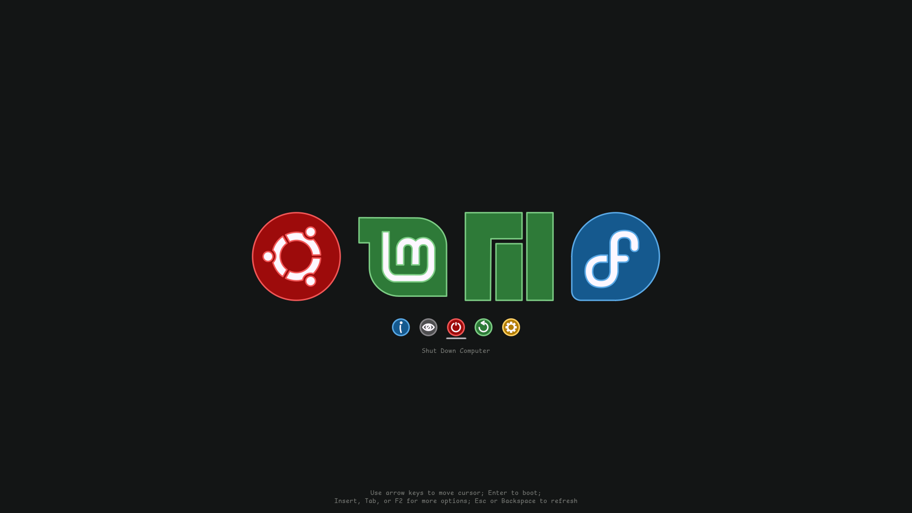

# rEFInd Pure Sketch Theme 

rEFInd Pure Sketch is a custom theme for the rEFInd UEFI boot manager. The theme features a sleek design and comes with multiple icon and font sizes, suitable for a variety of display resolutions. 

 My configuration:



Alternative configuration:



## Installation

1. Ensure that you have the rEFInd boot manager installed on your system.

2. Clone this repository into your local machine:     

```shell
git clone https://github.com/pure-sketch/refind-pure-sketch
```

3. Navigate into the cloned repository:     

```shell
cd refind-pure-sketch
```

4. Run the installation script:

```shell
./install.sh
```

The script will prompt you to select a theme size (very small, small, medium, large, very large). The medium size is recommended for display resolutions of 1920x1080. 
If everything goes well, you should see a "Theme installed successfully!" message. 

## Development

The source files for the theme are located in the `src` directory. If you wish to modify the theme or create a new configuration, please start from these source files. Detailed instructions for working with the source files can be found in the `README` located within the `src` directory.

## Troubleshooting

If you encounter any problems during the installation, please check the following: 

1. Make sure you have rEFInd installed on your system. 

2. Ensure that your EFI partition is mounted and the rEFInd directory is located at `/boot/efi/EFI/refind`. 

3. Ensure you have the necessary permissions to perform operations in the rEFInd directory. The install script requires root privileges. If you still experience issues, please submit an issue on the GitHub repository. 

## Acknowledgements

- The [rEFInd's developer](http://www.rodsbooks.com/refind/) for developing and maintaining the rEFInd boot manager.
- The creators and contributors of the [rEFInd Regular Theme](https://github.com/bobafetthotmail/refind-theme-regular) for providing inspiration in developing rEFInd Pure Sketch
- [shannpersand](https://github.com/shannpersand), the creator of the [Comic Shanns](https://github.com/shannpersand/comic-shanns), for the font used in this theme.

## Contact

If you have any questions, suggestions, or just want to chat, you can find me on [Telegram](https://t.me/Zalimannard) or get in touch through [GitHub](https://github.com/zalimannard).

## License

This project is licensed under the MIT License
